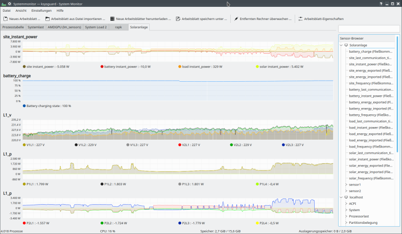
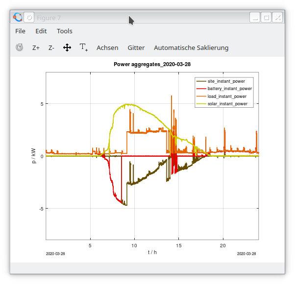
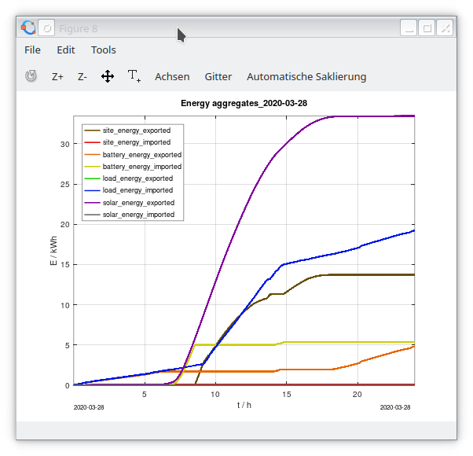
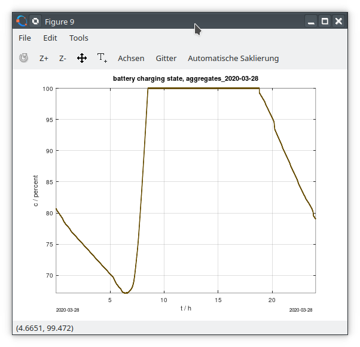

# tesla_solaredge - Tesla Powerwall logger

https://github.com/Github6am/tesla_solaredge.git

This project is a collection of scripts and tools performing 
data logging and analyis of my solar roof PV system with a
Tesla Powerwall2 battery storage.  
Currently it consists of several more or less related main components:

1. [teslogger.sh](teslogger.sh)  
   The logger runs 24/7 on a Raspberry Pi and collects json messages
   from the Tesla Powerwall Gateway via ethernet.
   It can also do some conversion of the logged files, see option -h.

2. [tlpower.m](tlpower.m)  
   The postprocessor runs on GNU Octave or Matlab and currently can 
   retrieve and visualize logged data on a day-by-day basis.

3. [solarmonitor.awk](solarmonitor.awk)  
   An independent ksysguardd monitor daemon is able to send requests 
   to the Tesla Powerwall Gateway and converts and forwards 
   information to the Linux KDE ksysguard system monitor

4. Support files and work in progress

The comment header of each file provides more information on its usage and background.

If you consider using this material, some IP adresses need to be patched.  
* The logger host name here is "rapk" or 192.168.2.6  
* The json data is retrieved from adress 192.168.2.9  

* update Feb 2021: unfortunately Tesla updated the Gateway Software
  behind the scene to 20.49.0 on 2021-02-02. 
  As a consequence https access to the sensor data did not work anymore.
  This is very annoying, especially since Tesla does not publish the API.

* update Mar 2021: Thanks to https://github.com/vloschiavo/powerwall2.git
  access is possible using cookies.

## Screenshots

This is a view of live solar data in the Linux ksysguard system monitor

  

The following figures show the matlab/octave plots for 
power, energy and battery charge when invoking

    tlpower('aggregates_2020-03-28.json.gz');

  
  
  

## Related projects
a search on github with keywords *tesla*, *powerwall* and/or *solaredge*
nowadays reveals a wealth of material, for example:  
https://github.com/vloschiavo/powerwall2  refers https://tesla-api.timdorr.com/ unofficial documentation of the Tesla JSON API  
https://github.com/mlowijs/tesla_api  
https://github.com/piersdd/tesla-powerwall-json-py  
https://github.com/jrester/tesla_powerwall  
https://github.com/mihailescu2m/powerwall_monitor  

https://github.com/jbuehl/solaredge  monitoring the performance data of SolarEdge inverters and optimizers.  

However, most of these projects did not exist at the time when I started my work.

## Appendix: github markdown

https://github.github.com/gfm

    pandoc -f gfm -o readme.html README.md   # create local HTML file
    dillo readme.html &                      # view with a web browser

